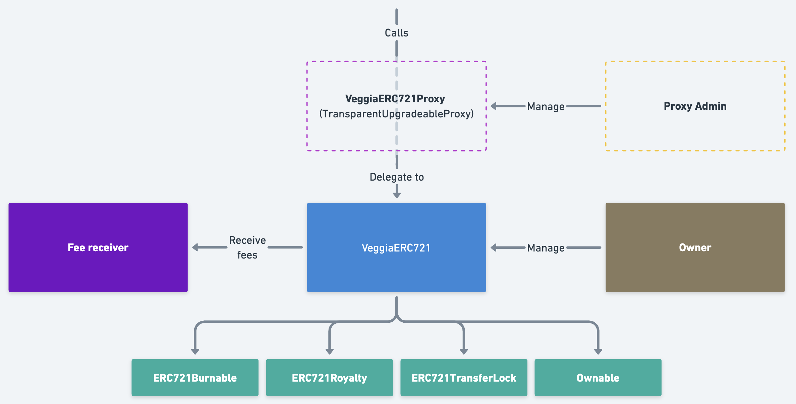

# VeggiaERC721 Protocol

Welcome to the **VeggiaERC721** protocol! This README provides a guide for developers and users who want to integrate or understand how this protocol works. Below, you will find detailed explanations about architecture, deployment, key functionalities, and various contract interactions.

---

## Table of Contents

1. [Introduction](#introduction)
2. [High-Level Overview](#high-level-overview)
3. [Architecture](#architecture)
    - [VeggiaERC721](#veggiaerc721)
    - [VeggiaERC721Proxy (TransparentUpgradeableProxy)](#veggiaerc721proxy-transparentupgradeableproxy)
    - [ERC721TransferLock](#erc721transferlock)
4. [Key Features](#key-features)
    - [Caps and Premium Caps](#caps-and-premium-caps)
    - [Free Minting (freeMint3)](#free-minting-freemint3)
    - [Paid Minting (mint3)](#paid-minting-mint3)
    - [Signature-based Minting (mint3WithSignature)](#signature-based-minting-mint3withsignature)
    - [Buying Caps and Premium Caps (buyCaps)](#buying-caps-and-premium-caps-buycaps)
    - [Premium Pack (buyPremiumPack)](#premium-pack-buypremiumpack)
    - [Burning NFTs (burn and batchBurn)](#burning-nfts-burn-and-batchburn)
    - [Locked Token Mechanism (First Mint Lock)](#locked-token-mechanism-first-mint-lock)
5. [Contract Interaction Flow](#contract-interaction-flow)
6. [Deployment & Initialization](#deployment--initialization)
7. [Configuration & Admin Functions](#configuration--admin-functions)
8. [Security Considerations](#security-considerations)
9. [Potential Diagrams](#potential-diagrams)
10. [Contributing](#contributing)
11. [License](#license)

---

## Introduction

**VeggiaERC721** is a specialized ERC721-based NFT protocol that introduces the concept of **caps**—special minted items that can be “opened” to produce NFTs. It also supports premium features, fee distribution, and a first-mint token lock mechanism. This protocol consists of:

- A core ERC721 contract: **VeggiaERC721** (logic contract).
- A **TransparentUpgradeableProxy**-based approach to allow upgradability: **VeggiaERC721Proxy**.
- A locked-transfer extension: **ERC721TransferLock**, to restrict transfers under certain conditions.

---

## High-Level Overview

- **Free Mint Limit & Cooldown**: Users can accumulate free “caps” over time, subject to a limit and cooldown.
- **Paid Caps & Premium Caps**: Users can purchase additional caps or premium caps, each yielding NFTs when opened.
- **Premium Packs**: Users can buy a pack containing one NFT mint plus several caps/premium caps.
- **Signature-based Mint**: Administrators can issue signed messages that allow specific wallets to mint.
- **Token Lock Mechanism**: During the first user mint, the third minted token is locked (non-transferable), ensuring unique usage scenarios such as quest-based or loyalty-based unlocks.

---

## Architecture

The VeggiaERC721 protocol relies on a proxy/logic separation, ensuring that upgrades can be managed transparently.



### VeggiaERC721

- **Name & Symbol**: Set to `"Veggia"` and `"VEGGIA"`.
- **Extended Functionality**:
  - **ERC721Burnable** – allows token burning.
  - **ERC721Royalty** – sets up royalty information (currently defaulted to 0%).
  - **ERC721TransferLock** – to lock transfers for specific tokens.
  - **Ownable** – standard OpenZeppelin ownership pattern.

### VeggiaERC721Proxy (TransparentUpgradeableProxy)

- This contract is deployed once and references:
  - **Implementation (VeggiaERC721)** address.
  - **Proxy Admin** (usually a dedicated `ProxyAdmin` contract).
- Users interact with the proxy address. Calls are **delegatecalled** to the implementation, preserving state in the proxy.

### ERC721TransferLock

- A lightweight abstract contract that extends ERC721.
- Allows locking certain tokens, preventing their transfer. 
- Once a token is locked, it **cannot** be unlocked.

---

## Key Features

Below are the main features you can leverage in VeggiaERC721.

### Caps and Premium Caps

- **Caps** and **Premium Caps** function like "virtual items" that can be used to mint new NFTs.
- They are represented in the contract as user balances (`paidCapsBalanceOf` and `paidPremiumCapsBalanceOf`).
- A user “opens” 3 caps or 3 premium caps to mint 3 new NFTs at once (see [`mint3`](#paid-minting-mint3)).

### Free Minting (`freeMint3`)

- Users accumulate **free caps** over time.
- The **free mint** mechanism allows users to **open 3 free caps** at once and mint 3 NFTs:
  1. **Accumulation** is based on `freeMintCooldown` (default 12 hours).
  2. The maximum free caps a user can accumulate is `freeMintLimit`.
  3. If the user has at least 3 accumulated free caps, they can mint 3 NFTs immediately.
- Internally, the contract calculates how many free caps the user has by measuring the time since their last mint against the cooldown.

### Paid Minting (`mint3`)

- Users can buy caps or premium caps using the function `buyCaps(bool isPremium, uint256 quantity)`.
- Once they have at least 3 caps or premium caps, they can call `mint3(isPremium)` to burn 3 of their cap balances and mint 3 NFTs in a single call.

### Signature-based Minting (`mint3WithSignature`)

- **Signature-based mints** are performed using `mint3WithSignature(bytes memory signature, bytes calldata message)`.
- **Caps Signer** (`capsSigner`) authorizes specific wallets to mint via an ECDSA signature.
- The `message` includes who is allowed to mint, an index used for uniqueness, and whether it’s for premium or regular caps.
- Prevents replay via `signatureMintsOf[to][index]`.

### Buying Caps and Premium Caps (`buyCaps`)

- Users call `buyCaps(bool isPremium, uint256 quantity)` with Ether matching the assigned price.
- Prices are mapped by `capsPriceByQuantity` and `premiumCapsPriceByQuantity`.
- A user’s purchased caps are tracked in `paidCapsBalanceOf` or `paidPremiumCapsBalanceOf`.

### Premium Pack (`buyPremiumPack`)

- A **convenience** function to purchase a pack with:
  - 1 NFT directly minted,
  - 12 standard caps + 3 premium caps (i.e., 12 “standard” plus 3 “premium,” or simply 12 + 3 in some versions).
- The user pays the `premiumPackPrice`.
- Upon purchase, the user automatically receives an NFT plus the additional cap balances.

### Burning NFTs (`burn` and `batchBurn`)

- An NFT holder can burn their tokens. 
- For `batchBurn`, the user can specify an array of token IDs to burn in one transaction.
- When burning, the transfer lock is bypassed (so locked tokens can still be burned).

### Locked Token Mechanism (First Mint Lock)

- On the **first** time a user mints 3 NFTs (via `freeMint3`, `mint3`, or `mint3WithSignature`), the **third token** is automatically locked.
- The contract calls `_lockToken()` on that third token if `hasMinted[msg.sender]` is `false`.
- This locked NFT cannot be transferred but can be burned by its owner.

---

## Contract Interaction Flow

To clarify how users typically interact with the VeggiaERC721 protocol:

1. **User accumulates free caps** or decides to purchase caps.
2. **User checks if** they have enough caps/premium caps (3 minimum):
   - If using free caps: call `freeMint3()`.
   - If using paid caps: call `mint3(isPremium)`.
3. If the user wants a more direct purchase approach:
   - Call `buyCaps(isPremium, quantity)` to increase their cap balance.
   - Or call `buyPremiumPack()` to get an immediate NFT + additional caps.
4. If the admin wants to allow a specific wallet to mint:
   - The admin signs a message. The user calls `mint3WithSignature(signature, message)`.
5. **Token is minted** and the third minted token of the user’s first mint is **locked**.
6. **Ownership** can be managed by the `owner()` (the address set as contract owner) using various admin functions.

---

## Deployment & Initialization

1. **Deploy the Logic Contract** – Deploy `VeggiaERC721` as the **implementation** contract.
2. **Deploy the Proxy** – Deploy `VeggiaERC721Proxy`, specifying:
   - The logic contract address.
   - An `initialOwner` (the ProxyAdmin).
3. **Initialize** – Once the proxy is deployed, the `ProxyAdmin` calls `initialize` on the proxy:
   ```solidity
   VeggiaERC721Proxy.initialize(
       owner,          // Address that will own the contract
       feeReceiver,    // Destination for fees (caps purchase, etc.)
       capsSigner,     // The authorized signer for signature-based mints
       baseUri         // The base URI for token metadata
   );
   ```
   After successful initialization, the contract is ready for usage.

[Diagram: Provide a diagram illustrating how the proxy is deployed and the calls to `initialize` are made by the `ProxyAdmin`. Emphasize that normal users interact only with the proxy’s address.]

---

## Configuration & Admin Functions

The **owner** of the VeggiaERC721 contract (not necessarily the ProxyAdmin) can manage various parameters:

- **`setBaseURI(string _baseUri)`**  
  Updates the base URI for metadata.

- **`setCapsPrice(uint256 quantity, uint256 price)`** / **`setPremiumCapsPrice(uint256 quantity, uint256 price)`**  
  Configure or update the price for a specific quantity of caps/premium caps.

- **`setPremiumPackPrice(uint256 price)`**  
  Updates the cost of the premium pack.

- **`setFreeMintLimit(uint256 limit)`**  
  Updates the maximum free caps a user can accumulate. Must be a multiple of 3.

- **`setFreeMintCooldown(uint256 cooldown)`**  
  Updates the time interval for accumulating free caps.

- **`setFeeReceiver(address receiver)`**  
  Changes the recipient for all Ether fees.

- **`setCapsSigner(address _capsSigner)`**  
  Changes the authorized ECDSA signer for signature-based mints.

---

## Security Considerations

1. **Locked Tokens**: 
   - If a token is locked, it is permanently non-transferable, though it can be burned. 

2. **Signature-based Mints**:
   - Validate that the `capsSigner` is secured properly. 
   - The contract checks `signatureMintsOf[to][index]` to prevent replay attacks.

3. **TransparentUpgradeableProxy**:
   - The `ProxyAdmin` has the power to upgrade the whole implementation.

4. **Fee Receiver**:
   - The `feeReceiver` address is critical for collecting proceeds. Keep it safe and monitor for potential misconfiguration.

5. **Free Minting**:
   - The `freeMintCooldown` logic relies on `block.timestamp`. Malicious miners cannot manipulate time significantly, but small deviations are possible. This is generally acceptable in most use cases.

---

## Contributing

### Get started
Set up the code repository using the following command:
```bash
make
```

> [!NOTE]
> This command set up the repo and install deps

### Run tests
To verify that everything is working correctly, run:
```bash 
forge test
```

### Code coverage
To check quickly code coverage run this command
```bash
forge coverage
```

To generate code coverage report us the following command
```bash
forge coverage --rport lcov
```

To generate code coverage report and open it in your browser run
```bash
make coverage
```

To open code coverage in your browser without generating report run
```bash
make open-coverage
```

---

## License

This repository’s code is licensed under the **Business Source License 1.1 (BUSL-1.1)**. Under BUSL-1.1:

- Use is limited, except where explicitly permitted by the license, until the “Change Date” specified in the license.
- On the Change Date, the code becomes available under a less restrictive license (as stated in the BUSL-1.1 text).

For full details and any additional terms, please refer to the complete **BUSL-1.1** license text. 

---
